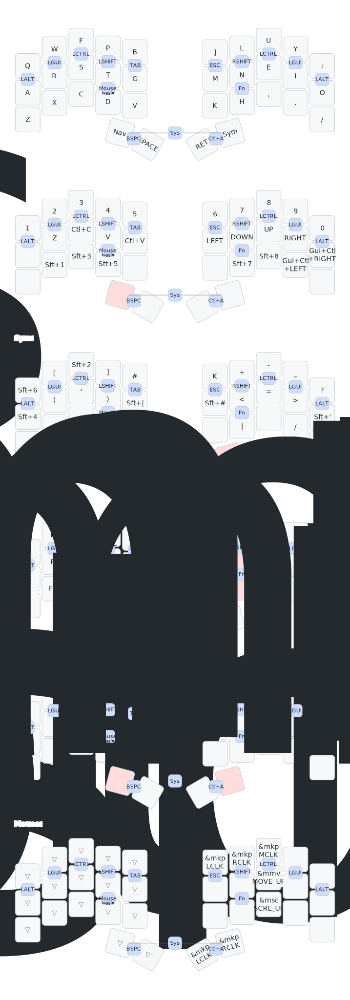
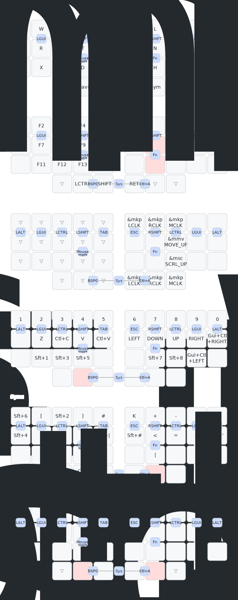
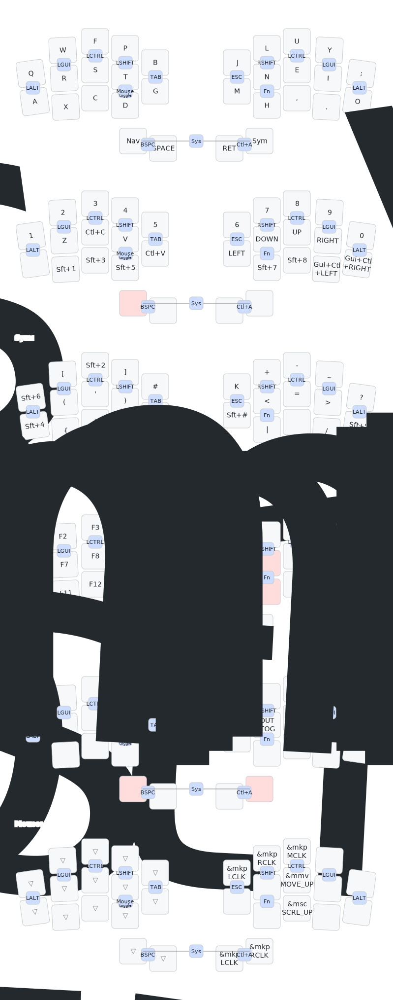
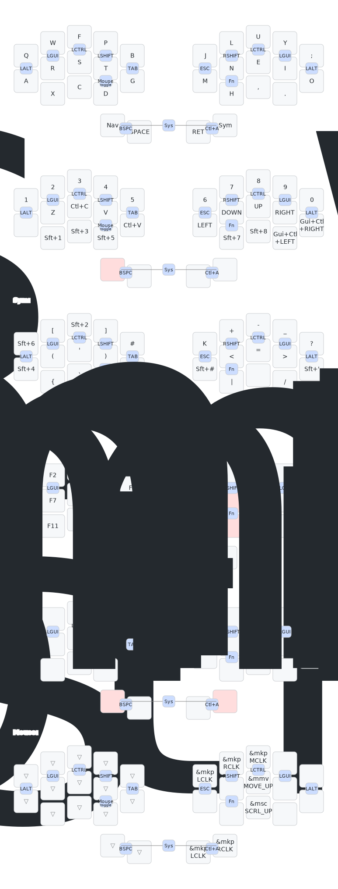

# ZMK config

Colemak-DH keymaps for my split keyboards, built with [ZMK firmware](https://zmk.dev).

## Keyboards

| Board | Keys | Connectivity |
|---|---|---|
| [Cradio / Sweep](https://github.com/davidphilipbarr/Sweep) | 34 | Wireless (nice!nano) |
| [Cheapino](https://github.com/tompi/cheapino) | 36 | Wired |
| [Phantom](https://github.com/davidphilipbarr/phantom) | 30 | Wireless (nice!nano) |
| [Berylline](https://github.com/minusfive/zmk-config) | 30 | Wireless split (nice!nano + dongle) |
| [Hummingbird](https://github.com/PJE66/hummingbird) | 30 | Wired (XIAO RP2040) or Wireless (XIAO BLE) |

## Cradio keymap

## Cheapino keymap

## Phantom keymap

## Berylline keymap

## Hummingbird (wired) keymap

## Hummingbird (wireless) keymap

> Keymap diagrams generated by [keymap-drawer](https://github.com/caksoylar/keymap-drawer)
